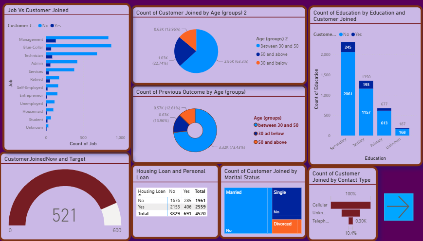
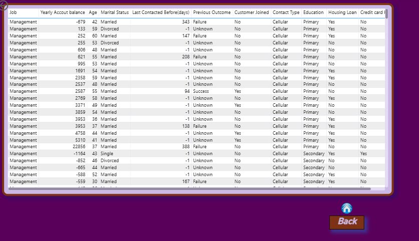

# Bank Marketing Campaign Analytics 📊

## Project Overview

This project analyzes a bank marketing campaign dataset to identify customer behavior patterns, campaign performance, and factors influencing term deposit subscriptions.

The project involves data cleaning, transformation, exploratory analysis, and dashboard development using Microsoft Excel and Power BI.

---

## Objective

To analyze customer and campaign data to understand:

- Customer demographics and subscription trends
- Factors influencing term deposit acceptance
- Campaign effectiveness
- Customer segmentation insights

---

## Tools & Technologies

- Microsoft Excel
  - Data Cleaning
  - Conditional Formatting

- Power BI
  - Data Modeling
  - DAX Measures
  - KPI Cards
  - Interactive Visualizations
  - Slicers
  - Drill-through Analysis

## Dataset

**Bank Marketing Dataset**

The dataset contains customer information and marketing campaign details used to analyze subscription patterns.

Key attributes include:

- Customer demographics
- Contact details
- Campaign information
- Previous marketing outcomes
- Term deposit subscription status

---

## Data Cleaning & Preparation

Performed data preprocessing steps:

- Identified missing and inconsistent values
- Checked data quality issues
- Cleaned and transformed raw data
- Prepared data for visualization and analysis

---

## Dashboard Features

The Power BI dashboard includes:

- Customer subscription analysis
- Campaign performance overview
- Customer segmentation
- Interactive filters and slicers
- Drill-through pages
- KPI-based reporting

---

## Key Insights

- Analyzed customer groups with higher subscription rates
- Identified campaign trends affecting customer decisions
- Compared customer characteristics and deposit subscription behavior

---

## Project Files

The repository contains the following files:

Bank-Marketing-Campaign-Analytics

├── bank.csv
├── excel/
│   └── Cleaned_Bank_Marketing_Data.xlsx
├── powerbi/
│   └── Bank_Marketing_Campaign_Dashboard.pbix
└── screenshots/
    ├── Dashboard_Page_1.png
    └── Dashboard_Page_2.png

## Dashboard Preview

The dashboard provides interactive analysis of customer segments, campaign performance, and subscription trends.

### Dashboard Page 1

### Dashboard Page 2

## Conclusion

This project demonstrates the complete analytics workflow — from raw data cleaning and transformation to dashboard development and business insight generation using Excel and Power BI.
